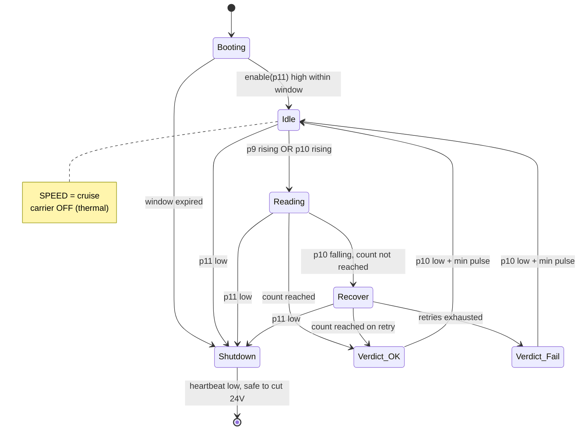

# PLC Digital I/O Interface — intelli-rfid-tunnel

Status: **design note, drafted without hardware.** The pin assignment is as specified by the
customer/integrator. Everything about module and CM4 behaviour is read from the vendor SDK docs and
the SIMx500 hardware manual — **nothing has been run against a reader.** Items marked **TBD** need a
number from the PLC integrator before anything is wired.

Related: `SGTIN-96-Encoding-Reliance.md` (read/write API, read-time levers, §7.3 trigger design).

---

## 1. Pin map

12-pin field connector. One shared field common (pin 8) serves both directions.

| Pin | Dir | Name | Function |
|---|---|---|---|
| 1 | OUT | `SPEED0` | Conveyor speed, bit 0 (LSB) — **TBD confirm bit order** |
| 2 | OUT | `SPEED1` | Conveyor speed, bit 1 |
| 3 | OUT | `SPEED2` | Conveyor speed, bit 2 (MSB) |
| 4 | OUT | `DIRECTION` | 0 = forward, 1 = reverse |
| 5 | OUT | `RESULT_OK` | Success — exit pallet, green light |
| 6 | OUT | `RESULT_FAIL` | Failure — red light, exit pallet; detail via REST |
| 7 | OUT | `SPARE_OUT` | Spare — **recommend allocating as `HEARTBEAT`, §9** |
| 8 | — | `FIELD_COM` | Field common for pins 1–7 and 9–12 |
| 9 | IN | `ZONE_ARRIVE` | Pulses high ~5 s when pallet/box enters the measurement zone |
| 10 | IN | `ZONE_OCCUPIED` | High while the pallet is in the zone; falls at end of zone |
| 11 | IN | `READER_ENABLE` | High = reader may run. Low = shut down, then remove 24 V |
| 12 | IN | `SPARE_IN` | Spare — **recommend `RESCAN_REQUEST`, §9** |

Outputs are reader → PLC. Inputs are PLC → reader.

---

## 2. Where each pin physically terminates — and why it is not all one place

**The SIM7500 module has only 2 GPI and 2 GPO.** The SIMx500 hardware manual states "2 inputs 2
outputs GPIO", named IN1/IN2 and OUT1/OUT2, at 3.3 V logic. Twelve field pins cannot terminate on
the module. So the interface splits:

| Field pins | Terminate on | Why |
|---|---|---|
| 9, 10 | **Module IN1, IN2** (and, in parallel, CM4 GPIO) | These two are the inventory trigger. Wiring them to the module lets `BackReadOption.IsGPITrigger` start and stop inventory **inside the module, with no host round-trip** — see §5 and `SGTIN-96…md` §7.3. |
| 11, 12 | CM4 GPIO | Supervisory, not timing-critical |
| 1–7 | CM4 GPIO | Seven outputs; the module has two, and host-driven `SetGPO` goes over the serial link anyway |

Wiring 9 and 10 to **both** the module and the CM4 is deliberate: the module gets the low-latency
hardware trigger, and the application still sees the edges so it can run the zone state machine,
timestamp the window, and drive the conveyor. It costs one extra opto channel each.

**Electrical characteristics from the hardware manual, which the isolation design must respect:**

- Module **GPI has a built-in 30 kΩ pull-up and idles logic 1 (high)**. An opto pulling to ground
  therefore presents *active-low* at the module. This is why the vendor's trigger demo configures
  `gpiStats[0].State = 0` as the trigger condition. Field-high must map to module-low, or the
  polarity must be inverted in the trigger config — pick one and document it, do not do both.
- Module **GPO is push-pull, default logic 0 (low)** on power-up.
- Module GPIO command action time is >78 µs (OUT) / >88 µs (IN), excluding link time.

### 2.1 Electrical — TBD, and it is a safety item

None of the following is specified yet, and the failsafe behaviour of the whole line depends on it:

- **Sourcing or sinking (PNP or NPN)?** Is pin 8 `FIELD_COM` at 0 V or at +24 V?
- **Field voltage** — assumed 24 VDC.
- **Isolation** — opto-isolation on every channel is assumed. Required, not optional: the conveyor
  and its VFD share the field ground and are an excellent source of transients.
- **Output drive** — what current must pins 1–7 sink/source, and does the PLC input side have its
  own pull to a defined level?

**The one that matters most:** with de-energised outputs reading as logic 0, a dead or unpowered
reader leaves `SPEED = 000` — **conveyor stopped** — which is the correct failsafe. If the wiring
ends up active-low, the same failure means **full speed with no reader**. Confirm the polarity in
writing and prove it by pulling the reader's power during commissioning and watching what the
conveyor does.

---

## 3. Inputs

### 3.1 Pin 9 — `ZONE_ARRIVE`

Rising edge = a pallet has entered the measurement zone. The pulse is ~5 s, which is much longer
than a read (~1–2 s), so **treat it as an announcement, not as the read window**. Use the rising
edge only; ignore the level and ignore the falling edge.

- Rising edge → arm the cycle, latch `t0`, start inventory.
- A second rising edge while a cycle is still active → fault `ARRIVE_DURING_CYCLE`. Something is
  wrong with pallet spacing or debounce; do not silently restart, report it.

### 3.2 Pin 10 — `ZONE_OCCUPIED`

High for the whole time the pallet is in the zone; the **falling edge is the hard deadline** — the
pallet is at the end of the zone and a verdict is needed.

Pins 9 and 10 both describe the same event, which is useful redundancy. Define precedence rather
than leaving it to chance:

- **Start** on whichever of (pin 9 rising, pin 10 rising) arrives first.
- **Deadline** on pin 10 falling.
- Pin 10 rising with no pin 9 pulse within a debounce window → warn, but proceed. A missing arrival
  pulse should not stop the line.
- Pin 9 pulse with no pin 10 rise within **TBD ms** → fault `ZONE_SENSOR_DISAGREE`. Two sensors
  disagreeing is a sensor fault, and it is better found on day one than in month three.

### 3.3 Pin 11 — `READER_ENABLE`: an interlock, and a shutdown hazard

Semantics as specified: high = the reader may run; low = shut down, after which the 24 V supply is
removed; a power cycle is required to restart; on power-up pin 11 must go high within **TBD
seconds** for the reader to stay on.

**Two numbers are missing and both are load-bearing.**

**(a) Post-power-up window — the value left blank in the specification.** This must exceed CM4 boot
plus JVM start plus reader initialisation. A Raspberry Pi CM4 booting Linux and starting a Spring
Boot application is realistically 20–40 s, and that is before the module is opened and configured.
**Propose 60 s**, and measure the real figure on the CM4 before agreeing anything shorter. If the
PLC expects an answer in 5 s, the interface is unbuildable as written and the conversation needs to
happen now rather than at commissioning.

**(b) Hold time between pin 11 going low and the 24 V being cut — the hazard.** Pulling power from a
running Linux system risks filesystem damage, and in this application it risks one file in
particular: **the serial-number high-water mark** (`SGTIN-96…md` §5.1). That file is the only thing
preventing duplicate serials, and a duplicate serial silently corrupts the customer's data in a way
that is not detectable from the reader afterwards.

Required sequence on pin 11 falling:

```
pin 11 -> low
  1. stop inventory, drop the RF carrier
  2. SPEED = 000 (stop the conveyor), DIRECTION = 0
  3. finish or abort any in-flight tag write; fsync the serial counter; close it
  4. sync(); remount data partition read-only
  5. drive HEARTBEAT (pin 7) low  ->  this is the "safe to cut power" signal
  6. systemctl poweroff
```

Ask the integrator for a **minimum hold of TBD (propose ≥ 10 s)**, or, better, have the PLC watch
pin 7 going low and cut power on that. That turns a timing assumption into a handshake. Failing
both, the mitigation is hardware: a supercapacitor or UPS hat giving the CM4 a few seconds of
run-on, plus mounting the counter partition with `O_SYNC` writes on a journalled filesystem.

The counter design already fsyncs **before** each write precisely so that a crash over-allocates
(a harmless gap) rather than replays (a duplicate). That is the safety net; the hold time is the
belt.

### 3.4 Pin 12 — spare input

See §9.

---

## 4. Outputs

### 4.1 Pins 1–3 — conveyor speed

Three bits, 0 = stopped through 7 = fastest.

| SPEED2 (p3) | SPEED1 (p2) | SPEED0 (p1) | Value | Meaning |
|---|---|---|---|---|
| 0 | 0 | 0 | 0 | Stopped |
| 0 | 0 | 1 | 1 | Slowest |
| 0 | 1 | 0 | 2 | |
| 0 | 1 | 1 | 3 | |
| 1 | 0 | 0 | 4 | |
| 1 | 0 | 1 | 5 | |
| 1 | 1 | 0 | 6 | |
| 1 | 1 | 1 | 7 | Fastest |

**TBD, and all three matter:**

- **Bit order.** The table assumes pin 1 = LSB. Confirm — getting it backwards turns "slow down" into
  "speed up", which is exactly the wrong failure in a tunnel.
- **Physical meaning.** What surface speed is each of 1–7, in m/s? Without that the reader cannot
  reason about dwell time in the field, and the closed loop in §6 is guesswork.
- **Change behaviour.** Does the PLC ramp between values or step? A step change mid-pallet may shift
  or topple a load. If it ramps, what is the ramp rate, and does the reader need to wait for it?
- **Glitch safety.** The three bits do not change atomically on GPIO. Passing 4 → 3 can transiently
  present 7 (`100` → `111` → `011`) depending on write order. Either the PLC latches on a strobe, or
  the reader must sequence writes so no transient exceeds both the old and new value. **Simplest
  fix: ask for a fourth line as a strobe, or restrict the reader to single-step changes.** Raise this
  before the wiring is finalised.

### 4.2 Pin 4 — direction

0 = forward, 1 = reverse. Only meaningful when speed ≠ 0. Never change direction with speed non-zero:
set `SPEED = 000`, wait **TBD ms** for the drive to stop, then flip direction, then set the new speed.

### 4.3 Pins 5 and 6 — verdict

- `RESULT_OK` (5): the required tag count was read (or written) — exit pallet, green light.
- `RESULT_FAIL` (6): the operation failed — red light, exit pallet, detail on the REST API.

Rules:

- **Mutually exclusive.** Never both high. Assert as one operation with the other cleared first.
- **Exactly one is asserted per cycle** — there is no "no verdict" outcome. If the deadline passes
  with nothing decided, that is `RESULT_FAIL`, not silence. Silence would hold a pallet indefinitely.
- **Timing.** Assert on decision, hold until pin 10 falls (pallet gone) plus a **minimum pulse width
  of TBD (propose 200 ms)** so a fast-moving pallet cannot produce a pulse the PLC scan misses.
- **Clear** both on the next cycle's start edge, not on the previous cycle's end, so the PLC always
  has a stable verdict to read for the whole inter-pallet gap.

**One decision needed on what counts as success.** Today's rule is "the expected count was reached".
But a box can reach 40 correct articles *and* contain a wrong-SKU article — which the read reports
in `unexpected` (and which `responseMode: CONCISE` hides from the WMS entirely). Is that a green
light or a red one? It is a picking error, and the tunnel is the only place it will ever be caught.
Recommend a config switch, defaulting to treating it as a failure:

```yaml
plc:
  failOnUnexpectedTags: true
```

---

## 5. The measurement cycle



Nominal timing for one pallet:

```
p9  ___/‾‾‾‾‾‾‾‾‾‾‾‾‾‾‾\_________________   (~5 s announcement pulse)
p10 ___/‾‾‾‾‾‾‾‾‾‾‾‾‾‾‾‾‾‾‾‾‾‾‾\_________   (falling edge = deadline)
RF  ______/‾‾‾‾‾‾‾‾‾‾‾‾‾\________________   (carrier only while needed)
p5  ______________________/‾‾‾‾‾‾‾‾‾\____   (verdict, min 200 ms)
         ^t0        ^40th tag   ^decision
```

The RF trace is the point: the carrier is up only between the trigger and the verdict, which is
where the ~10% duty cycle in `SGTIN-96…md` §7.3 comes from. Pins 9 and 10 are what make that
possible — without them the reader would have to transmit continuously and guess where the boxes are.

---

## 6. Closed-loop conveyor control — the capability this pin-out unlocks

Because the reader drives speed *and* direction, it is not a passive observer. If the count is short
as the deadline approaches, it has three moves before it has to give up:

1. **Slow down.** Drop `SPEED` a step or two. More dwell time in the RF field, more inventory rounds,
   and it costs only conveyor throughput rather than a rejected pallet.
2. **Stop.** `SPEED = 000` and keep reading. The pallet sits in the best part of the field.
3. **Reverse and re-scan.** `SPEED = 000`, pause, `DIRECTION = 1`, low speed, run the pallet back
   through and read again. Tag orientation relative to the antennas changes, which is often exactly
   what recovers the two tags hiding behind a metallised pack.

**Move 3 has a protocol trap, and the fix is already in hand.** In session S2, every tag read on the
forward pass is in state B and **will not answer a Target-A round on the way back**. A naive reverse
re-scan would return almost nothing and look like a total failure.

The fix is the Select-to-A reset confirmed available in the SDK (`SGTIN-96…md` §7.1):
`SelCmd_Target.SelC_Inventoried_S2` with `SelCmd_Action.Mat_SLorA_NMat_no` resets the matching
population to "unread" in one command, costing effectively nothing. **Issue that Select immediately
before every re-scan pass.** Without it this feature does not work at all; with it, it is close to
free.

Suggested policy, all in config:

```yaml
plc:
  cruiseSpeed: 5                 # 0-7, normal pass speed
  recovery:
    enabled: true
    slowSpeed: 2                 # step 1: slow down
    stopAndDwellMs: 800          # step 2: stop and keep reading
    reversePasses: 1             # step 3: how many reverse re-scans before giving up
    reverseSpeed: 2
    directionSettleMs: 500       # wait after SPEED=000 before flipping DIRECTION
    resetInventoriedFlagBeforePass: true   # THE Select-to-A above — do not disable
```

**Recovery must be bounded and visible.** Every recovery action costs line throughput, so log the
recovery path taken per pallet and expose the rate on the Actuator endpoint. A slowly rising
recovery rate is the earliest warning that antenna alignment, tag placement, or RF environment has
drifted — long before it shows up as red lights.

Also confirm with the integrator: **is the reader permitted to reverse the conveyor at all?** It may
be mechanically or safety-prohibited, or upstream pallets may make it impossible. If reversal is out,
`reversePasses: 0` and recovery stops at "stop and dwell".

---

## 7. Failsafe and fault behaviour

| Condition | Outputs | Notes |
|---|---|---|
| Reader unpowered / crashed | all low → `SPEED = 000` | Conveyor stops. Depends on the polarity in §2.1 — **verify physically.** |
| Pin 11 low | `SPEED = 000`, verdict cleared, heartbeat low | §3.3 shutdown sequence |
| Module comms lost | `SPEED = 000`, `RESULT_FAIL` if mid-cycle | Do not keep running the line blind |
| Deadline passed, no verdict | `RESULT_FAIL` | There is no "no verdict" outcome |
| Second `ZONE_ARRIVE` mid-cycle | `RESULT_FAIL` for the cycle in progress | Pallet spacing fault, reported |
| Antenna VSWR alarm | `RESULT_FAIL`, `SPEED = 000` | VSWR is readable per antenna via CC33 telemetry |
| Over-temperature | `SPEED = 000`, refuse new cycles | Module temperature via CC33 / `MTR_PARAM_RF_TEMPERATURE` |

**On over-temperature: the hardware manual gives a real data point.** With the module on a 29×29 mm
FR4 baseplate at 28 °C ambient and only **15 dBm** output, measured surface temperatures were 81 °C
at the power amplifier, 70 °C at the E710 and 70 °C at the baseplate. The tunnel is configured for
**30 dBm** — thirty times the RF output power. Whatever the enclosure does, this is not a theoretical
concern, and it is the strongest argument for the trigger-driven duty cycle. Log the CC33 temperature
per pallet from day one and set the over-temperature threshold from a real shift, not from a guess.

Debounce every input. **TBD** with the integrator; 10–20 ms is typical for 24 V PLC signals, and
pin 11 wants more (say 100 ms) because a spurious low there costs a power cycle.

---

## 8. Latency budget — TBD, and it constrains everything upstream

The unanswered question that sizes the whole design: **how long after pin 10 falls may the reader
take to assert pin 5 or 6?**

If the PLC diverts the pallet immediately on the falling edge, the verdict must be ready *before* it,
which means the read must finish while the pallet is still mid-zone — and the effective read window
is shorter than the zone transit time by that margin. If instead the PLC holds the pallet briefly at
the exit, the reader gets the whole transit plus the hold.

Get: the zone length, the conveyor speed for each of 1–7, and the PLC's decision deadline. Those
three numbers convert "5 seconds per box" into an actual RF window, which is what
`SGTIN-96…md` §7 is trying to fit into.

---

## 9. The two spare pins — recommendations

**Pin 7 → `HEARTBEAT` (output).** Pin 11 lets the PLC kill the reader, but nothing currently tells
the PLC that the reader has *hung* — a wedged JVM holds its outputs at their last value forever, and
the line keeps running as though everything is fine. A square wave (propose 1 Hz, driven from a
watchdog thread that only toggles if the read path is actually healthy) closes that loop: no edge for
3 s means the PLC stops the line and cycles pin 11. It also gives the shutdown handshake in §3.3 —
heartbeat low = safe to cut 24 V. **This is the highest-value use of a spare pin here** and the
recommendation is to allocate it now, while the connector is still on paper.

**Pin 12 → `RESCAN_REQUEST` (input).** An operator or the PLC asks for a re-scan of the pallet
currently in the zone without a full cycle restart. Useful during commissioning and for manual
recovery when a red light is disputed. Falls back gracefully: if never wired, nothing changes.

If the integrator prefers to keep them physically spare, both should still be defined in the protocol
document so the meaning is not invented later by whoever needs a pin first.

---

## 10. Configuration

```yaml
plc:
  enabled: true
  pins:                          # CM4 GPIO (BCM numbering) — TBD from the carrier board schematic
    speed0: 17
    speed1: 27
    speed2: 22
    direction: 23
    resultOk: 24
    resultFail: 25
    heartbeat: 5                 # pin 7, see §9
    zoneArrive: 6                # pin 9  — also wired to module IN1
    zoneOccupied: 13             # pin 10 — also wired to module IN2
    readerEnable: 19             # pin 11
    spareIn: 26                  # pin 12
  activeHigh: true               # *** VERIFY PHYSICALLY (§2.1) *** governs the failsafe
  debounceMs: 15
  enableDebounceMs: 100          # pin 11 wants more; a false low costs a power cycle
  cruiseSpeed: 5
  verdictMinPulseMs: 200
  failOnUnexpectedTags: true
  heartbeatHz: 1
  bootEnableWindowSec: 60        # TBD — must exceed CM4 boot + JVM + module init
  shutdownHoldSec: 10            # TBD — minimum 24 V hold after pin 11 low
  zoneSensorDisagreeMs: 1500     # TBD
  recovery:
    enabled: true
    slowSpeed: 2
    stopAndDwellMs: 800
    reversePasses: 1
    reverseSpeed: 2
    directionSettleMs: 500
    resetInventoriedFlagBeforePass: true
moduleTrigger:
  useHardwareGpi: true           # BackReadOption.IsGPITrigger
  type: TRI1START_TRI2STOP       # pin 9 starts, pin 10 stops — vendor demo pattern
  gpi1State: 0                   # module GPI idles HIGH (30k pull-up) — see §2
  gpi2State: 0
  stopTriggerTimeoutMs: 5000     # backstop if the stop edge never arrives
```

---

## 11. Open questions for the PLC integrator

Electrical, before anything is wired:

1. Sourcing or sinking — is `FIELD_COM` (pin 8) at 0 V or +24 V? Field voltage confirmed as 24 VDC?
2. Required drive current on pins 1–7, and the PLC input impedance.
3. **Does the PLC read de-energised outputs as speed 0 (stop)?** Verify by killing reader power on
   the bench and watching the conveyor.

Protocol:

4. Speed bit order — is pin 1 the LSB?
5. Physical surface speed for each of values 1–7.
6. Does the PLC ramp or step between speed values, and at what rate?
7. Are the three speed bits latched on a strobe, or read asynchronously? If asynchronous, §4.1's
   transient-value problem needs a solution (a strobe line, or single-step-only changes).
8. Is the reader permitted to **reverse** the conveyor? Mechanically and from a safety standpoint.
9. Verdict timing: how long after pin 10 falls may the reader take to assert pin 5 or 6? (§8)
10. Zone length, and the transit time at cruise speed.

Power and lifecycle:

11. **Post-power-up window for pin 11** — the value left blank. 60 s proposed; anything under ~40 s
    is likely unbuildable on a CM4 running Linux.
12. **Minimum 24 V hold after pin 11 goes low** — 10 s proposed, or better, have the PLC watch the
    heartbeat (pin 7) go low and cut power on that handshake instead of on a timer. (§3.3)
13. Debounce times the PLC already applies, so the reader does not double-debounce.

Allocation:

14. Agreement on the spare pins: pin 7 as `HEARTBEAT`, pin 12 as `RESCAN_REQUEST`. (§9)
15. Does a wrong-SKU article in an otherwise complete box mean green or red? (§4.3)

## 12. To verify on the CM4

1. Which CM4 GPIO lines the carrier board actually routes to the 12-pin connector — from the
   schematic, then confirmed by toggling each one and metering the pin.
2. Whether field pins 9 and 10 are wired to the module's IN1/IN2 at all. If they are not, the
   hardware trigger in §2 is unavailable and the trigger becomes a host-side GPIO interrupt — still
   workable, but it puts host latency back into the read window and the timing in §8 must be
   re-checked.
3. Real CM4 boot-to-ready time, which sets the pin 11 window in §3.3(a).
4. Module temperature under the real duty cycle in the real enclosure at 30 dBm (§7).
5. That the Select-to-A reset genuinely restores tags for a reverse pass (§6) — the single test that
   decides whether recovery move 3 exists.
